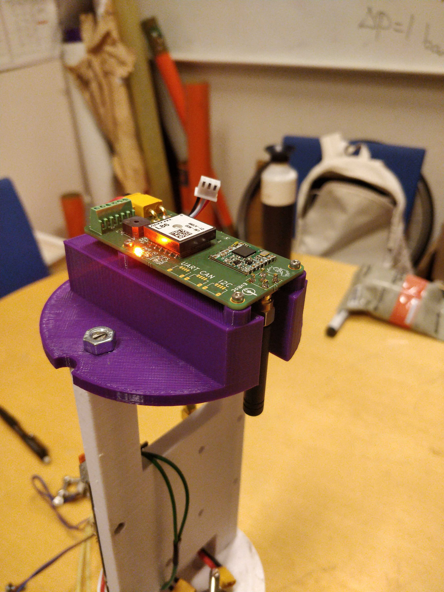

# Fjalar firmware

<video src='docs/nokia.mp4' width=180>

### Overview
This repository contains code to support a flight controller. Currently, the only supported hardware is the [Fjalar flight controller](https://github.com/aesirkth/fjalar_flight_controller) (as the name suggests) but one of the goals of this project is portability.

### sub-projects
The codebase is split into three projects, the dashboard, the handheld tracker firmware and the flight firmware. Ideally these should be split into separate repositories eventually.

Both firmwares use zephyr and are located in the `/application/` folder.

### dependencies
#### Zephyr SDK
Building the software is most easily done with the Zephyr SDK. This is separate thing from the Zephyr RTOS/library and is just a bundle with tools for compiling, linking and so on. Please refer to the [zephyr docs](https://docs.zephyrproject.org/latest/develop/toolchains/zephyr_sdk.html) on how to install.

#### Python
It is recommended to set up a Python virtual environment for the repository. A virtual environment is basically a sandbox isolate each project and prevent collisions between library versions. The project can be built without this but there will most likely be unexpected issues a few months down the line.

Configuring one can be as simple as running `python -m venv .venv`. Every time you want to build something run `source .venv/bin/activate` to activate and enter the virtual environment.

#### West & Zephyr
The project is built and managed using [West](https://docs.zephyrproject.org/latest/develop/west/index.html). West will automatically fetch everything Zephyr related (other than the SDK).

**important** there is a bug in the used version of Zephyr. Before installing anything in the virtual environment you need to install a specific version of pillow `pip install pillow==9.4.0`.

West can be installed through pip `pip install west`. (enable your virtual environment first if you have one). Then run `west update` in the root of this repository to make West fetch Zephyr RTOS and all required dependencies.

### Flashing
#### Tracker
The tracker can be built and flashed using `west application/tracker -b t_echo -p auto`. Then you need to manually copy the firmware to the t-echo. Connect it over USB, double tap the reset button to enter the bootloader and mount it as a drive. Copy `build/zephyr/zephyr.uf2` to the new drive to flash.

#### Flight controller
Run `west build application/flight_controller/ -p auto -b fjalar -t flash` to build and flash.

### Native simulation
Both the tracker and flight firmware supports compiling for `native_sim_64` allowing you to run it natively. This only works on linux, if you are on Windows try using WSL 2 (WSL 1 doesn't work).

To run natively change the board to `-b native_sim_64` and use `-t run` instead of `-t flash`